# DIY Sidereal Star Tracker for the Orion SpaceProbe 130ST

I'm using the [Orion SpaceProbe 130ST telescope](https://www.highpointscientific.com/orion-spaceprobe-130st-short-tube-eq-reflector-telescope) with a [ZWO ASI224MC](https://www.zwoastro.com/product/zwo-asi224mc/) CMOS imaging camera and enjoy deep-sky imaging without breaking the bank. I got the telescope right before Orion ceased to exist and was therefore unable to purchase their [electronic tracking drive](https://www.amazon.com/Orion-Electronic-Tracking-Drive-Mount/dp/B0B9GHRXKY/ref=zg_bs_g_3426091_d_sccl_18/139-5786178-3062238?psc=1) for the EQ-13 mount that came with the telescope. As a result, I decided to make a simple driver myself. The total price was around $50 (I am not fully sure since I had various components already in house), with the cost dominated by the stepper motor (~$30).

The star tracker is powered by a 12 V source using 8× 1.5 V AA batteries. This power source is also used for my [Flat Frame Light Diffuser](https://github.com/SvenvB/Flat-frame-light-diffuser). The battery pack lasts at least one or two full nights imaging.

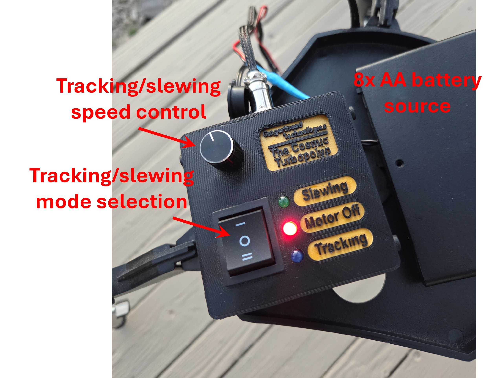

With this motor, I’ve been able to consistently achieve good tracking for exposure times of up to 5 seconds without noticeable star trailing. For example, see the stacked result of a 140-frame, 5-second exposure of the M27 Dumbbell Nebula:

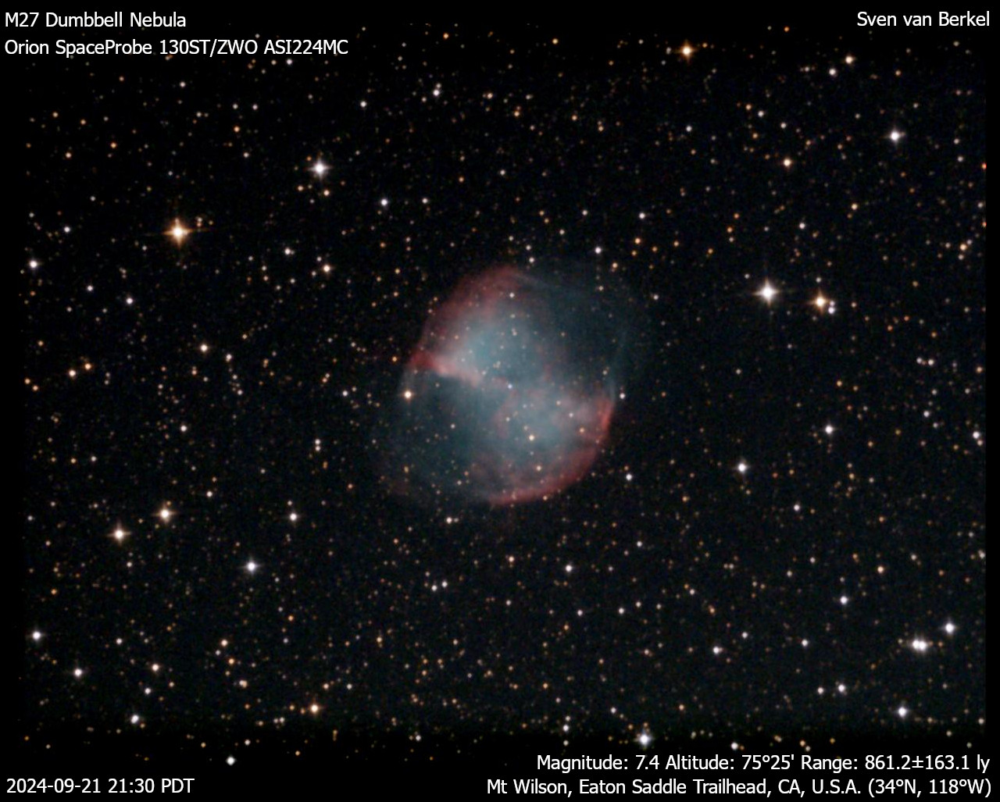

The exposure time can be pushed up to 20 seconds, as I tried recently when imaging the M51 Whirlpool Galaxy and M104 Sombrero Galaxy. At this exposure time, I had to discard about 50% of the frames due to noticeable star trailing, but the results were still quite nice:

**M51 Whirlpool Galaxy using 49 frames at 20-second exposure:**

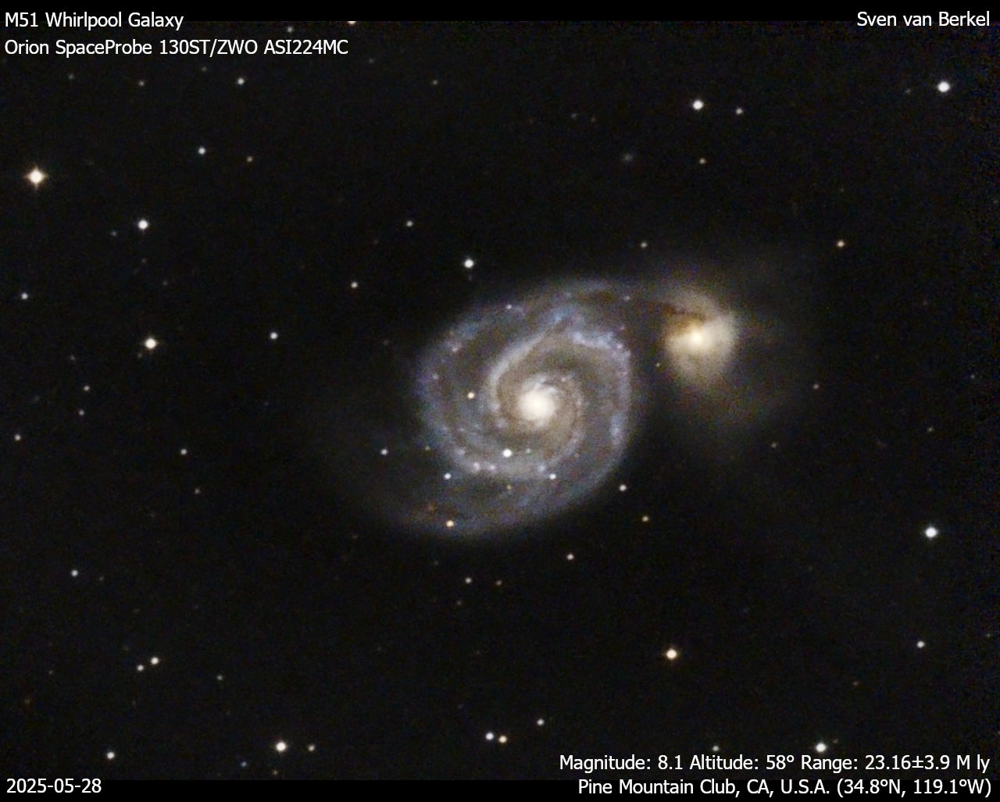

**M104 Sombrero Galaxy using 162 frames at 20-second exposure:**

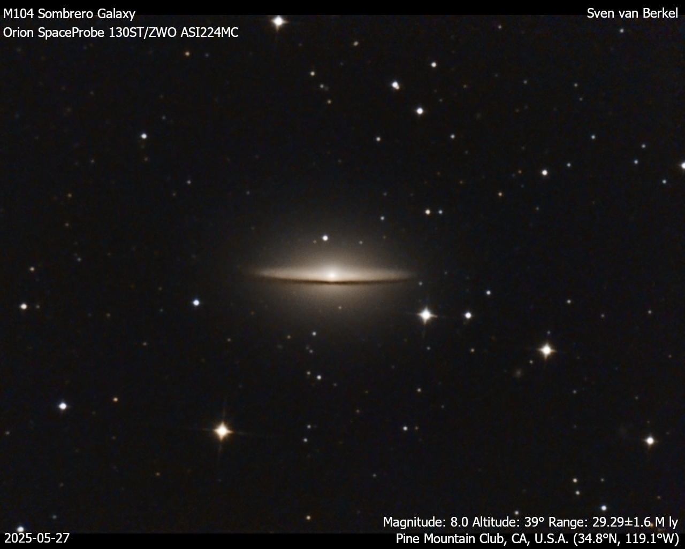

Keep in mind that the EQ-13 mount is very flimsy, so the effective tracking speed can be inconsistent and occasionally needs to be fine-tuned with the rotary encoder. Properly balancing the telescope with the counterweight is also important.

The star tracker has two modes: **Tracking** (sidereal speed) and **Slewing** (for quick repointing). Both speeds can be fine-tuned with the rotary encoder. Clicking the encoder resets the speed to its default value.

---

## Materials

* **Stepper motor** – The [17HS19-1684S-PG51](https://www.omc-stepperonline.com/nema-17-stepper-motor-bipolar-l-48mm-w-gear-ratio-51-1-planetary-gearbox-17hs19-1684s-pg51) has an 51:1 gear ratio Planetary Gearbox and 0.035 deg / step. 
* **[A4988 stepper motor driver](https://www.aliexpress.us/item/3256805793855652.html?src=google&pdp_npi=4%40dis%21USD%215.81%211.80%21%21%21%21%21%40%2112000035152956725%21ppc%21%21%21&src=google&albch=shopping&acnt=708-803-3821&isdl=y&slnk=&plac=&mtctp=&albbt=Google_7_shopping&aff_platform=google&aff_short_key=UneMJZVf&gclsrc=aw.ds&albagn=888888&ds_e_adid=&ds_e_matchtype=&ds_e_device=c&ds_e_network=x&ds_e_product_group_id=&ds_e_product_id=en3256805793855652&ds_e_product_merchant_id=5080850986&ds_e_product_country=US&ds_e_product_language=en&ds_e_product_channel=online&ds_e_product_store_id=&ds_url_v=2&albcp=19623912707&albag=&isSmbAutoCall=false&needSmbHouyi=false&gad_source=4&gad_campaignid=19616013570&gbraid=0AAAAAD6I-hHBkOKXJMnzFfLlYu7H2lh_F&gclid=CjwKCAjw3f_BBhAPEiwAaA3K5M1DYmCJJrGB-SmIvHADkCwvgrs8LZ0YxJ87CBh64NpMWFss14TvOhoCS8UQAvD_BwE&gatewayAdapt=glo2usa)** - with heatsink  
* **[Arduino Nano](https://www.aliexpress.us/item/3256805941736729.html?src=google&pdp_npi=4%40dis%21USD%211.40%211.40%21%21%21%21%21%40%2112000035881712633%21ppc%21%21%21&src=google&albch=shopping&acnt=708-803-3821&isdl=y&slnk=&plac=&mtctp=&albbt=Google_7_shopping&aff_platform=google&aff_short_key=UneMJZVf&gclsrc=aw.ds&albagn=888888&ds_e_adid=&ds_e_matchtype=&ds_e_device=c&ds_e_network=x&ds_e_product_group_id=&ds_e_product_id=en3256805941736729&ds_e_product_merchant_id=5293204312&ds_e_product_country=US&ds_e_product_language=en&ds_e_product_channel=online&ds_e_product_store_id=&ds_url_v=2&albcp=20546179873&albag=&isSmbAutoCall=false&needSmbHouyi=false&gad_source=1&gad_campaignid=17337505674&gbraid=0AAAAAD6I-hH9Do3V7PLbSMgWzNnF9Df5B&gclid=CjwKCAjw3f_BBhAPEiwAaA3K5HHcGXW2QnrE5iamtjPykZQPZXEYG24YuaDJb-yKoQAY5awy_wlY_hoCS_MQAvD_BwE&gatewayAdapt=glo2usa)**  
* **KY-040 Rotary Encoder** - with clickable switch
* **[AMS1117-5.0V voltage regulator](https://www.aliexpress.us/item/3256803404676437.html?src=google&pdp_npi=4%40dis%21USD%210.81%210.71%21%21%21%21%21%40%2112000036726215299%21ppc%21%21%21&src=google&albch=shopping&acnt=708-803-3821&isdl=y&slnk=&plac=&mtctp=&albbt=Google_7_shopping&aff_platform=google&aff_short_key=UneMJZVf&gclsrc=aw.ds&albagn=888888&ds_e_adid=&ds_e_matchtype=&ds_e_device=c&ds_e_network=x&ds_e_product_group_id=&ds_e_product_id=en3256803404676437&ds_e_product_merchant_id=108821505&ds_e_product_country=US&ds_e_product_language=en&ds_e_product_channel=online&ds_e_product_store_id=&ds_url_v=2&albcp=19108228023&albag=&isSmbAutoCall=false&needSmbHouyi=false&gad_source=1&gad_campaignid=19108292148&gbraid=0AAAAAD6I-hEQvsbF3m6vS52BjuQyr5Sz-&gclid=CjwKCAjw3f_BBhAPEiwAaA3K5JJGzJ1sDHvnzFAuJfsHekJ_CBdko_NY7DRJxSJSMnykyhvmJW4OUBoCTr8QAvD_BwE&gatewayAdapt=glo2usa)**
* **100 uF radial electrolytic capacitor** - for A4988 protection
* **4x through hole 5mm LEDs** - Three to indicate the motor mode and one to indicate that the controller is powered.
* **6x SMD 0805 resistors** - 4x for LED loading (~1 kOhm) and 2x pull-up resistors for the switch (>5 kOhm).
* **2A glass tube fuse and [fuse holder](https://www.amazon.com/dp/B074N1NMMX?ref_=ppx_hzsearch_conn_dt_b_fed_asin_title_1)** - for A4988 protection. The holder has 15mm pin spacing and can hold a 5x20mm fuse.
* **[5.5x2.1mm DC barrel jack](https://www.amazon.com/dp/B081DYQSC9/ref=pe_386300_440135490_TE_simp_item_image?th=1)** - for controller power supply
* **[4 pin aviation plug](https://www.amazon.com/dp/B07ZP725YD/ref=pe_386300_440135490_TE_simp_item_image)** - for connecting the stepper motor
* **[3 position rocker switch](https://www.aliexpress.us/item/2251832521009333.html?spm=a2g0o.order_list.order_list_main.80.21ef1802ewc4Qe&gatewayAdapt=glo2usa)** - for motor mode selection
* **2 position rocker switch** - for controller power ON/OFF
* **2x 5-pin JST connectors** - male and female for connecting the rotary encoder and Switch-and-LED board
* **2x 2-pin JST connectors** - male and female for connecting the power rocker switch and power to the Switch-and-LED board.
* **4-pin JST connector**  - male and female for connecting the aviation plug.
* **[8x AA battery holder](https://www.amazon.com/dp/B09LTSNJTW/ref=pe_386300_440135490_TE_simp_item_image)** - with 5.5x2.1mm Male Jack Connector
* **various screws** - to mount the PCBs to the casing and top-plate, to mount the top-plate to the casing, to connect the stepper motor to the 3D-printed mount, to prevent the 3D-printed coupling piece from slipping on the worm gear shaft, to connect the 3D-printed mount to the EQ-13 body.
* **3D printer and filament** - for the motor mount and controller box.

**Optional**
* **Capacitors** - at the output of the voltage regulator to reduce power supply noise. I used a 10 uF radial and 100 nF + 10 nF ceramic disc capacitors in parallel. 
* **Cable sleeve** - to organize the stepper motor wires.
* **3-pin screw terminal** - mounted on the switch-and-LED board, to easily connect and disconnect the 3-position rocker switch.

---

## Instructions

### 1. Calculate Stepper Motor Requirements

- Stepper motors are highly accurate and provide high torque, making them ideal for this application. A typical stepper motor has 200 steps per revolution (1.8°/step).
- I tested that the Right Ascension (RA) knob on the EQ-13 mount must be rotated about 5.5 times to move 1 hour in RA. This corresponds to roughly 132 revolutions over 24 h in RA, i.e., a worm gear ratio of 132:1.
- One sidereal day is 23h 56m 4s, or 86,164 seconds. Therefore, the worm gear should rotate at ~0.55°/s. Since a typical stepper motor would move only once every 3+ seconds at this rate, a gearbox is needed.
- Choosing a low gear ratio results in jerky tracking, while too high a gear ratio limits slewing speed.
- I chose the [17HS19-1684S-PG51](https://www.omc-stepperonline.com/nema-17-stepper-motor-bipolar-l-48mm-w-gear-ratio-51-1-planetary-gearbox-17hs19-1684s-pg51) stepper motor with a 51:1 gearbox. This gives a tracking speed of ~15.6 steps per second, which I would not recommend going below.

**RA worm gear visible in the picture below:**

---

### 2. Electrical Design

The controller uses two PCBs:

1. **Switch-and-LED board** – Mounted to the front plate. This board connects to the 3-position rocker switch, integrates pull-up resistors, and drives LEDs indicating the motor mode. It is reused from another project that daisy-chains the power pins two multiple boards.
2. **Controller board** – Mounted to the bottom of the casing. This board contains the Arduino, stepper motor driver, and supporting components.

Boards were designed in KiCAD. Gerber files are attached, and PCBs were ordered via JLCPCB.

#### Switch-and-LED Board
* The pin-headers shown below are not needed. You can directly solder the cables to the PCB, as is shown in the *Assembled Control Box* photograph in Section 4 below. 
* The schematic indicates LED resistors of 470 Ohm. However, I have found that the LEDs are too bright with those values. I recommend increasing them. 

*KiCAD Schematic:*
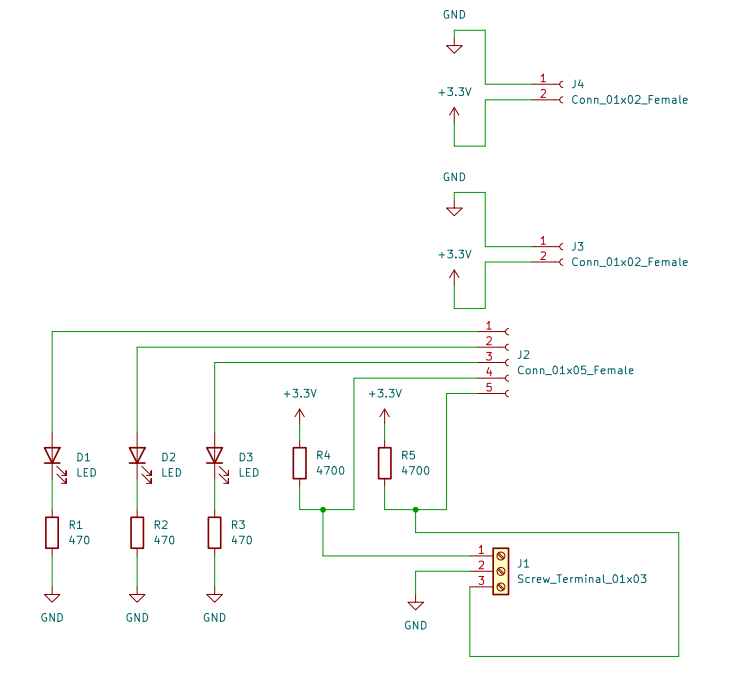

*KiCAD 3D View:*
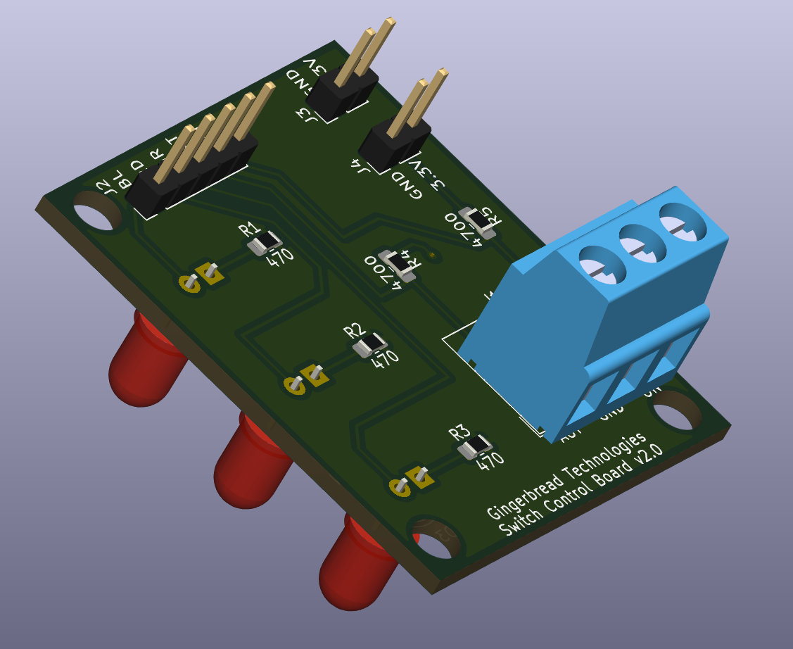

#### Controller Board

- Be sure to include the 100 µF capacitor. The A4988 can produce voltage spikes due to back-EMF from the stepper motor’s inductance. This capacitor helps absorb those spikes, protecting the driver. Place the capacitor as close to the driver as is possible.
- The capacitors at the AMS1117 output are optional.
- Use the method described [here](https://www.pololu.com/product/1182) to limit the A4988 current to your motor’s rated current (1.68 A/phase for mine).
- I have not employed microstepping to increase the number of steps per second. The motor might operate more smoothly if we half the step. However, it will mean tighter timing and more processing overhead for the Arduino, and a reduced torque per microstep. If the mount is imbalanced the torque might not be adequate. Something to be tested.

*KiCAD Schematic:*
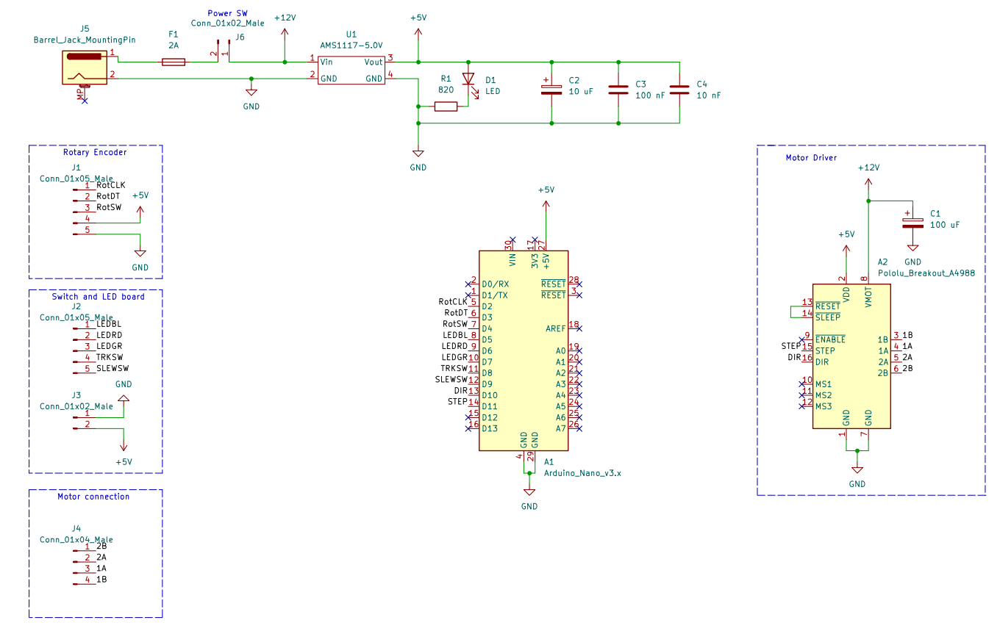

*KiCAD 3D View:*
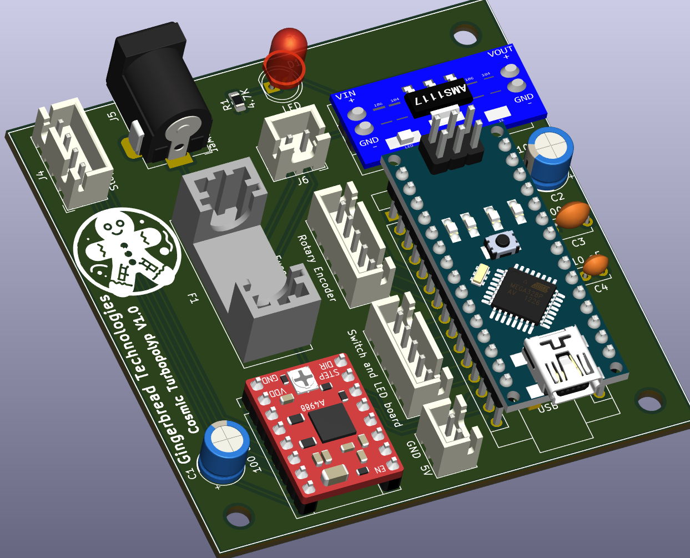

*Assembled Controller Photo:*
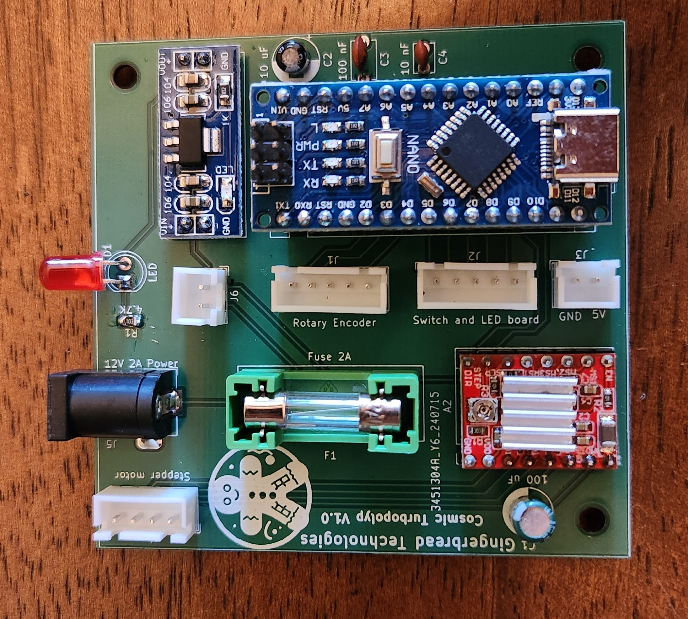

---

### 3. CAD Design

- The control box and motor mount were designed in FreeCAD. Design files and .STLs are attached.
- The coupling piece between the stepper motor and worm gear shaft (green part in the image) must fit very tightly to avoid backlash.
- You will need a screw to mate the coupling piece to the worm gear shaft. 

*FreeCAD View – Control Box (Closed):*
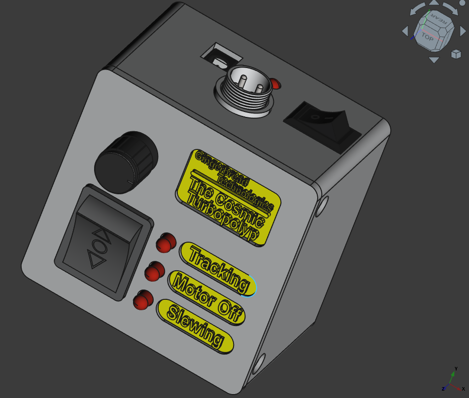

*FreeCAD View – Control Box (Open):*
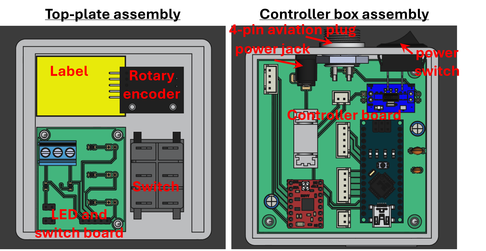

*FreeCAD View – Motor Mount:*
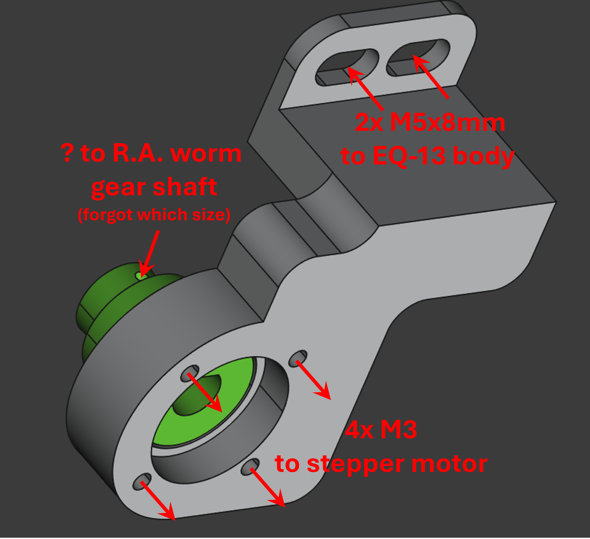

---

### 4. Assembly

- Mount the PCBs to the casing and top plate using screws.
- Avoid contact between wires and the heatsink of the stepper motor driver.

*Assembled Control Box:*
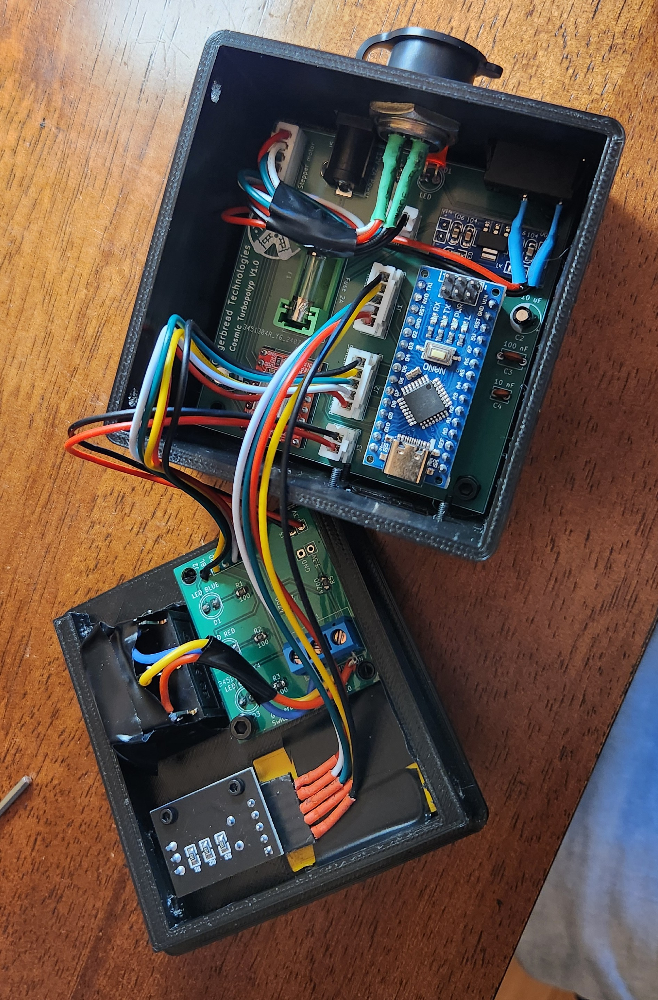

*Assembled Stepper Motor:*

---

### 5. Arduino Coding and Operation

- The Arduino is programmed using the standard Arduino IDE. Code is available [here](./Arduino/RA_Controller_V3/RA_Controller_V3.ino).
- I found the most stable tracking at 16.3 steps/second, close to the calculated 15.6 steps/sec sidereal speed.
- In **Tracking mode**, each rotary tick changes the speed by ±0.1 steps/sec.
- In **Slewing mode**, each tick changes the speed by ±1× sidereal rate. Slewing is possible in both RA directions.
- Clicking the rotary encoder resets the speed to its default value.

**Clear skies!**